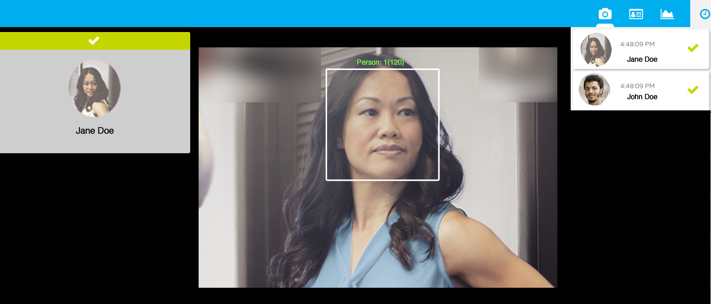
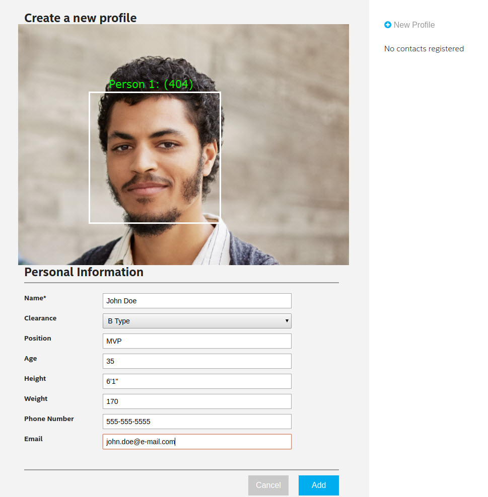
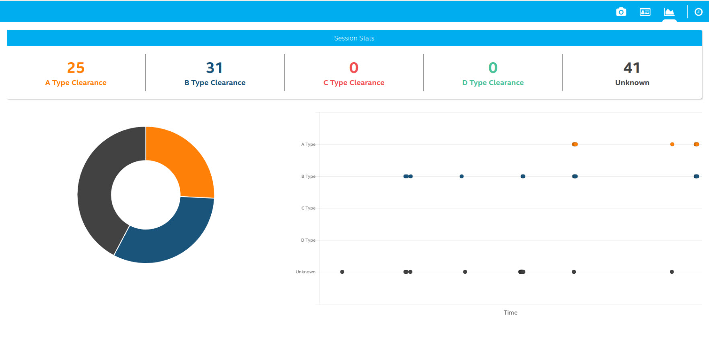

# IoT Reference Implementation: How-to Build a Face Access Control Solution

## Introduction

The Face Access Control application is one of a series of IoT reference implementations aimed at instructing users on how to
develop a working solution for a particular problem. The solution uses facial recognition as the basis of a control system
for granting physical access. The application detects and registers the image of a person’s face into a database, recognizes
known users entering a designated area and grants access if a person’s face matches an image in the database.

From this reference implementation, developers will learn to build and run an application that:
 * Detects and registers the image of a person’s face into a database
 * Recognizes known users entering a designated area
 * Grants access if a person’s face matches an image in the database

## How it Works

The Face Access Control system consists of two main subsystems:

### cvservice
 * [cvservice](./cvservice) is a C++ application that uses OpenVINO™. It connects to a
   USB camera (for detecting faces) and then performs facial recognition based on a training data file of authorized users to
   determine if a detected person is a known user or previously unknown. Messages are published to a MQTT\* broker when users
   are recognized and the processed output frames are written to stdout in raw format (to be piped to ffmpeg for compression
   and streaming). Here, Intel's Photography Vision Library is used for facial detection and recognition.

### webservice
 * [webservice](./webservice) uses the MQTT broker to interact with cvservice. It's an application based on Node.js\* for
   providing visual feedback at the user access station. Users are greeted when recognized as authorized users or given the
   option to register as a new user. It displays a high-quality, low-latency motion jpeg stream along with the user interface
   and data analytics.

In the UI, there are three tabs:
 * live streaming video
 * user registration
 * analytics of access history.

This is what the live streaming video tab looks like:

This is what the user registration tab looks like:

This is an example of the analytics tab:

## Hardware requirements

 * 5th Generation Intel® Core™ processor or newer *or* Intel® Xeon® v4, or Intel® Xeon® v5 Processors with Intel® Graphics Technology (if enabled by OEM in BIOS and motherboard)
[[tested on NUC6i7KYK](https://www.intel.com/content/www/us/en/products/boards-kits/nuc/kits/nuc6i7kyk.html)]
 * USB Webcam [tested with Logitech\* C922x Pro Stream]

## Software requirements

 * Ubuntu\* 16.04
 * [OpenVINO™](https://software.intel.com/en-us/computer-vision-sdk)

## How to set up

### OpenVINO™ 

#### Download and Install OpenVINO™

The guide for installing OpenVINO™ is offered [here](https://software.intel.com/en-us/articles/CVSDK-Install-Linux).
After completing the registration, download the archive for Ubuntu\*, unpack it, and run the GUI installer:

    tar xaf l_intel_cv_sdk_p_<version>.tgz
    cd l_intel_cv_sdk_p_<version>
    ./install_GUI.sh

When prompted, install as the root user or as a user with root permissions. The rest of the guide assumes you will install OpenVINO™ to the default location.

After installation, don't forget to source the OpenVINO™ environment variables:

    source /opt/intel/computer_vision_sdk/bin/setupvars.sh

This will be required for building and running cvservice.
To automate this process, you can source the script from `.profile` or `.bashrc`. Alternatively, you can add the variables to
`/etc/environment`.

### ffmpeg

This reference implementation uses ffmpeg to compress and stream video output from cvservice to the webservice clients. ffmpeg
is installed separately from the Ubuntu repositories:

    sudo apt update
    sudo apt install ffmpeg

### cvservice

#### Install Paho\* MQTT\* C client libraries dependencies
This reference implementation uses MQTT to send data between services. To install the dependencies:

    sudo apt update
    sudo apt install libssl-dev

Building the executable (from cvservice directory):

    mkdir build
    cd build
    cmake ..
    make

### webservice

Instructions on how to setup the Node.js services are provided in the [webservice](./webservice) folder.

## Running the application

1. Start the webservice, both server and front-end components.

2. Start ffserver with:

        sudo ffserver -f ./ffmpeg/server.conf

3. Export the needed ENV vars:

        export MQTT_SERVER=localhost:1883
        export MQTT_CLIENT_ID=cvservice
        export FACE_DB=./defaultdb.xml
        export FACE_IMAGES=../../webservice/server/node-server/public/profile/

4. From the `cvservice/build` directory start cvservice and pipe to ffmpeg:

        ./cvservice 0 2>/dev/null | ffmpeg -f rawvideo -pixel_format bgr24 -video_size vga -i - http://localhost:8090/fac.ffm

5. Browse to:

        http://localhost:8080
