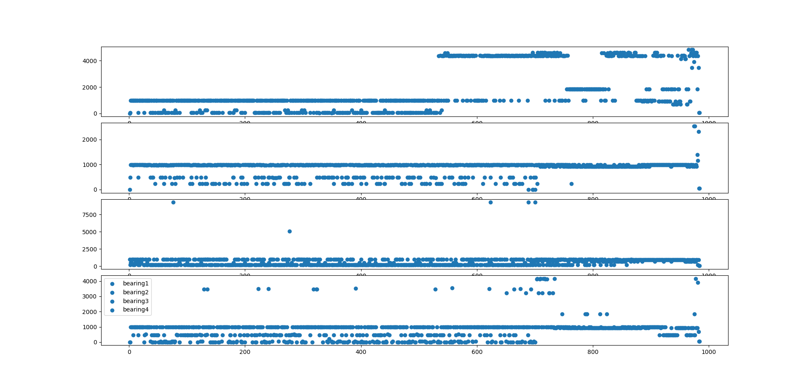
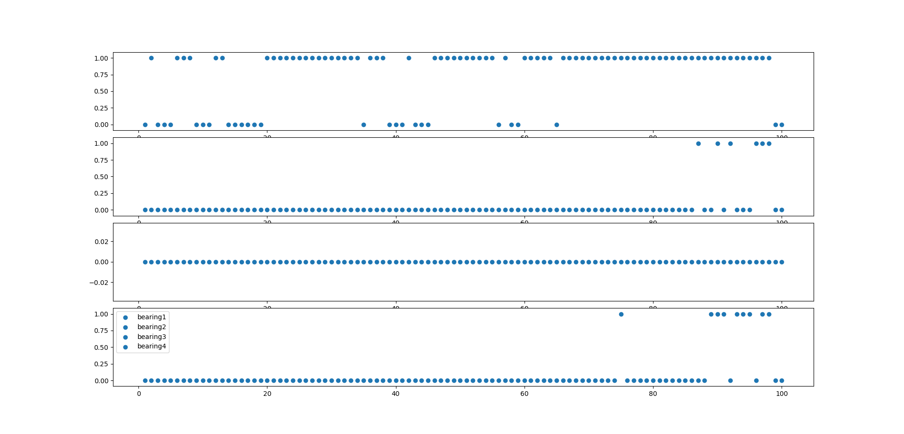
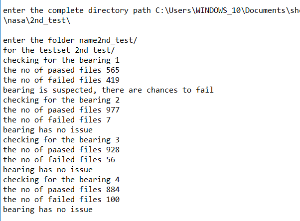
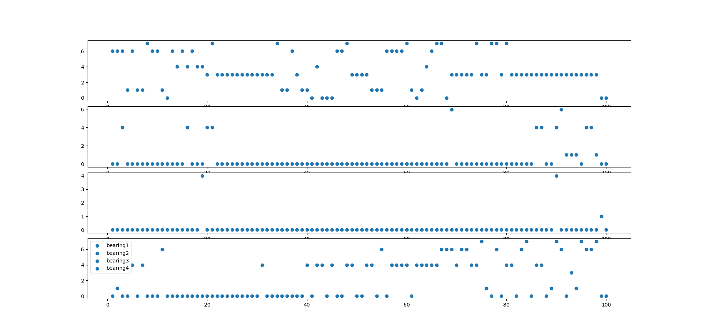
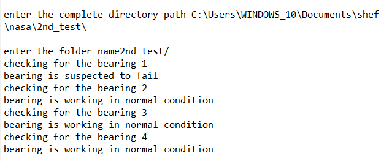
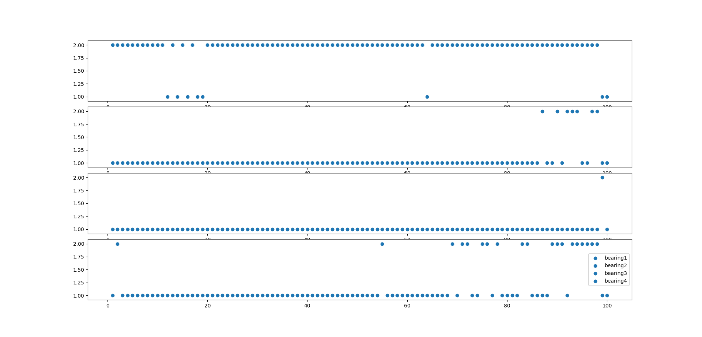
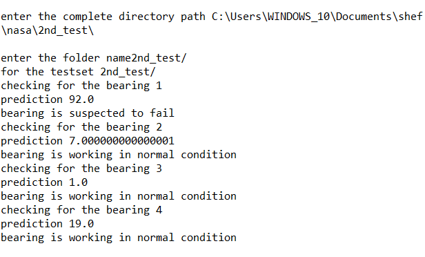

# Motor Fault Detector
## Introduction 
The monitoring of manufacturing equipment is vital to any industrial process.  Sometimes it is critical that equipment be monitored in real-time for faults and anomalies to prevent damage and correlate equipment behavior faults to production line issues.  Fault detection is the pre-cursor to predictive maintenance.

This reference implementation covers the basic implementation of FFT, Logistic Regression, K-Means clustering, GMM.  It also shows how FFT is helpful in Feature engineering of vibrational data of a machine.  

## How it Works
There are several methods which don&#39;t require training of a neural network to be able to detect failures, starting with the most basic (FFT), to the most complex (Gaussian Mixture Model).  These have the advantage of being able to be re-used with minor modifications on different data streams, and don&#39;t require a lot of known previously classified data (unlike neural nets).  In fact, some of these methods can be used to classify data in order to train DNNs.

## Requirements
##Hardware Requirements
*Tested on the [TANK AIoT Dev Kit] (https://software.intel.com/en-us/iot/hardware/iei-tank-dev-kit)

## Software Requirements
* Ubuntu* 16.04
* Python 3.5 with the following libraries: numpy, pandas, matplotlib.pyplot, sklearn, scipy

## Setup

1. Download the Bearing Data Set at [https://ti.arc.nasa.gov/tech/dash/groups/pcoe/prognostic-data-repository/](https://ti.arc.nasa.gov/tech/dash/groups/pcoe/prognostic-data-repository/)
2. Extract the zip format of data into respective folder named 1st\_test/2nd\_test.
3. Make sure you have the following libraries:

* Numpy
* Pandas
* Matplotlib.pyplot
* Sklearn
* Scipy

4. Download the code
5. Make sure all the code and data are in one folder

### Run the application

Open the example in console or any python supported IDE(for example Spyder ). Set the working directory where your code and dataset is stored.

 There are 4 samples: FFT, Logistic Regression,Kmeans,GMM so for each one of them one or multiple files to execute .

| SAMPLE FILE NAME | EXPECTED OUTPUT | Note |
| --- | --- | --- |
| FreqTime.py | Frequency v/s Time plot |   |
| Utils.py | Have all the function for all the module |   |
| Train\_logistic\_regression.py | Saved weight of the trained module in the filename &quot;LogisticRegression&quot; | Training for the logistic Regression is done on testset1 ,bearing4\_y axis (failed ),bearing 2\_x axis (passed ) and testset2 bearing1(failed),bearing2(passed)\*training dataset is increased for better result. |
| Test\_logistic\_regression.py | Result for the particular test set which bearing is failed and the plot of last 100 predicted labels for all the bearings. | Take input path from the user , he wants to check which bearing is suspected to fail, which is in normal condition |
| Train\_kmeans.py | Saved weight of the trained module in the filename &quot;Kmeans&quot; | Training for the Kmeans is done on testset1 ,bearing4\_y axis (failed ),bearing 2\_x axis (passed ) and testset2 bearing1(failed),bearing2(passed)\*training dataset is increased for better result. |
| Test\_kmeans.py | Result for the particular test set which bearing is failed and the plot of last 100 predicted labels for all the bearings. | Take input path from the user , he wants to check which bearing is suspected to fail, which is in normal conditionThe label **0-7 is the range(early-most critical for failure)****\*\* its able to detect the bearing 1\_y axis which is very close to failue, hence showing** |
| Train\_GMM.py | Saved weight of the trained module in the filename &quot;GMM&quot; | Training for the GMM is done on testset1 ,bearing4\_y axis (failed ),bearing 2\_x axis (passed ) and testset2 bearing1(failed),bearing2(passed)\*training dataset is increased for better result. |
| Test\_GMM.py | Result for the particular test set which bearing is failed and the plot of last 100 predicted labels for all the bearings. | Take input path from the user, he wants to check which bearing is suspected to fail, which is in normal conditionThe label **0-2 is the range(early-most critical for failure)** |

**Understanding the analysis methods**

**1. FFT:** A fast Fourier transform (FFT) is an algorithm that samples a signal over a period of time (or space) and divides it into its frequency components. These components are single sinusoidal oscillations at distinct frequencies each with their own amplitude and phase.

[Y](https://in.mathworks.com/help/matlab/ref/fft.html#f83-998360-Y) = fft( [X](https://in.mathworks.com/help/matlab/ref/fft.html#f83-998360-X)) computes the discrete Fourier transform (DFT) of X using a fast Fourier transform (FFT) algorithm. If X is a vector, then fft(X) returns the Fourier transform of the vector [**.more details**](https://en.wikipedia.org/wiki/Fast_Fourier_transform)

**2. Logistic Regression:** Logistic regression is a statistical method for analyzing a dataset in which there are one or more independent variables that determine an outcome. The outcome is measured with a dichotomous variable (in which there are only two possible outcomes).

In logistic regression, the dependent variable is binary or dichotomous, i.e. it only contains data coded as 1 (TRUE, success, pregnant, etc.) or 0 (FALSE, failure, non-pregnant, etc.).The goal of logistic regression is to find the best fitting (yet biologically reasonable) model to describe the relationship between the dichotomous characteristic of interest (dependent variable = response or outcome variable) and a set of independent (predictor or explanatory) variables. [More deatils](https://en.wikipedia.org/wiki/Logistic_regression)

**3. Kmeans Clustering:** K-means clustering is a type of unsupervised learning, which is used when you have unlabeled data (i.e., data without defined categories or groups). The goal of this algorithm is to find groups in the data, with the number of groups represented by the variable K. The algorithm works iteratively to assign each data point to one of K groups based on the features that are provided. Data points are clustered based on feature similarity.

 The results of the K-means clustering algorithm are:

- The centroids of the K clusters, which can be used to label new data
- Labels for the training data (each data point is assigned to a single cluster)

**Each centroid of a cluster is a collection of feature values which define the resulting groups. Examining the centroid feature weights can be used to qualitatively interpret what kind of group each cluster represents.** [**More details**](https://en.wikipedia.org/wiki/K-means_clustering)

**4. GMM:** A Gaussian mixture model is a probabilistic model that assumes all the data points are generated from a mixture of a finite number of Gaussian distributions with unknown parameters. One can think of mixture models as generalizing k-means clustering to incorporate information about the covariance structure of the data as well as the centers of the latent Gaussians.

The GaussianMixture object implements the expectation-maximization (EM) algorithm for fitting mixture-of-Gaussian models. It can also draw confidence ellipsoids for multivariate models, and compute the Bayesian Information Criterion to assess the number of clusters in the data. A GaussianMixture.fit method is provided that learns a Gaussian Mixture Model from train data. Given test data, it can assign to each sample the Gaussian it mostly probably belongs to using the GaussianMixture.predict method.

The GaussianMixture comes with different options to constrain the covariance of the difference classes estimated: spherical, diagonal, tied or full covariance. [more details](https://en.wikipedia.org/wiki/Mixture_model)

**Code Explanation:**

For all the samples the basic approach is same. Following are the steps that are basic steps:

- Take the fft of each bearing of each file.
- Calculate the Frequency and amplitude of it
- Calculate the top 5 amplitude and their corresponding frequency.
- Repeat the same for each bearing and each data file. Stored the result in the result data frame.

**For FFT** : it gives the Frequency vs time plot of each maximum frequency for each dataset.

  
*Figure 1.plot for the testset2, max2 frequency for all the bearing.*

**For Logistic regression:**

Calculate the label for the data frame (in depended variable). Assume that first 70% is in normal condition and rest 71-100% are suspected to fail. For the passed one give label &#39;0&#39; and for suspected to fail give label &#39;1&#39;. Train the logistic regression on result data frame. Stored the model using numpy.

For testing: Take input path from the user, he wants to check which bearing is suspected to fail &amp;which is in normal condition. Check the no of one label, and no of zero label in the last 100 predictions. If the no of one prediction is more than no oh zero label, then bearing is suspected to fail else it is in normal condition.

   
 *Figure 2.predicted last 100  labels for testset2, for all four bearings*

   
 *Figure 3.result for the bearcing which is failed for the testset2*

**For Kmeans Clustering** :

Fit the result data frame into Kmeans cluster , grouping into 8 cluster(no is obtained from elbow method). Save the trained model into Kmeans.

For testing, Take input path from the user, he wants to check which bearing is suspected to fail &amp;which is in normal condition. Calculate the no of label 5, 6 ,7 for the last 100 predictions if the its greater than 25 then its suspected to fail, else in normal condition.
   
 *Figure 4.predicted last 100 labels for testset2, for all four bearings using the Kmeans clustering*

   
 *Figure 5. result of testset2 which bearing has failed using the Kmeans clustering*

**For GMM:**

Fit the result data frame into gmm model, grouping into 3 components (components depicts no of clusters). Save the trained model as GMM using numpy.

For the testing, take input path from the user, he wants to check which bearing is suspected to fail &amp;which is in normal condition. Calculate the no of label 2 for the last 100 predictions if the its greater than 50 then its suspected to fail, else in normal condition.
  
 *Figure 6.predicted last 100 labels for testset2, for all four bearings using the GMM clustering*

   
 *Figure 7. result of testset2 which bearing has failed using the GMM clustering*

**NOTE:**

TESTSET 3 of Nasa bearing dataset is discarded for the observations because of the following reason:

1: It has 6324 file in actual, but according to the documentation its contains 4448 data file. This makes very noisy data.

2: None of the bearing show the symptom of failure, it suddenly fails. So it makes data inconsistent,

These listed reasons are why testset3 shows unpredictable behavior.

## (Optional) Saving Data to the Cloud
As an optional step you can take the data results and send them to an Amazon AWS instance for graphing.

1\. Make an EC2 Linux* instance on AWS
([*https://docs.aws.amazon.com/AWSEC2/latest/UserGuide/EC2\_GetStarted.html*](https://docs.aws.amazon.com/AWSEC2/latest/UserGuide/EC2_GetStarted.html))

2\. Install InfluxDB* on EC2 Linux instance
([*https://github.com/influxdata/influxdb*](https://github.com/influxdata/influxdb))

3\. Install Grafana on EC2 Linux instance
([*https://grafana.com/get*](https://grafana.com/get))
