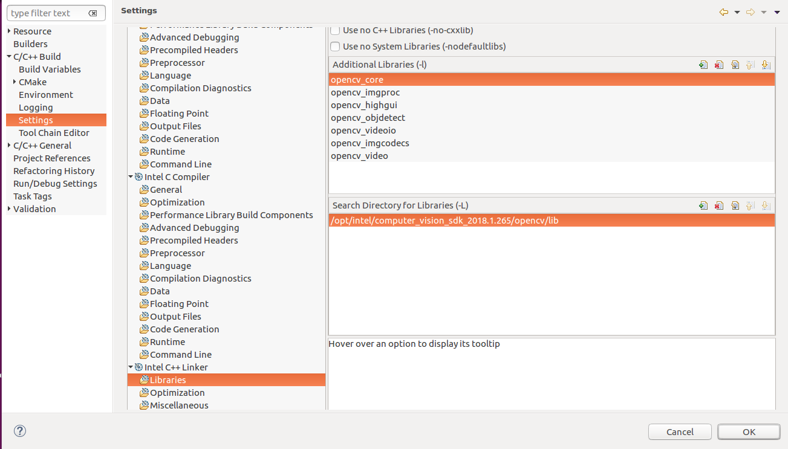
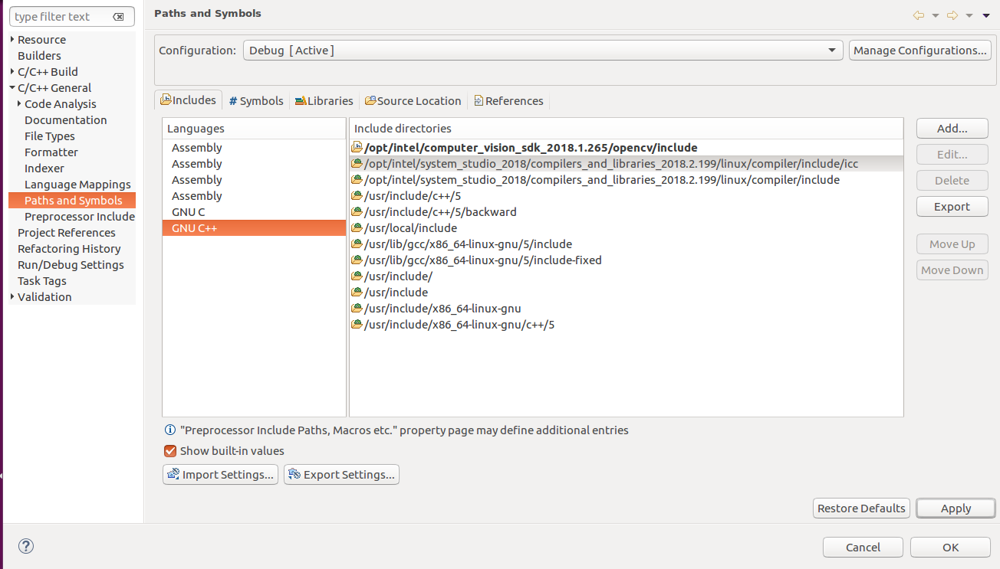
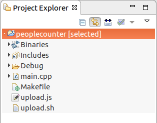
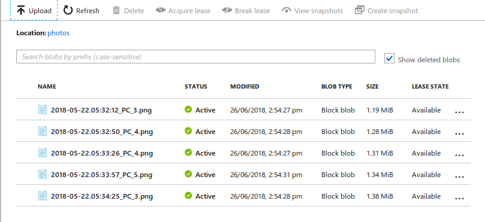

# Store Aisle Monitor

## Introduction

This reference implementation takes a video input (webcam/loaded video), generates a visual heatmap / motion map, counts the number of people present and integrates the results. The application has the functionality of creating an output video and saving a snapshot at a particular instance by the user to the cloud.

## Requirements
### Hardware
* [TANK AIoT Developer Kit] (https://software.intel.com/en-us/iot/hardware/iei-tank-dev-kit)
* *UVC compliant USB camera

### Software
* Ubuntu 16.04
* Intel(R) System Studio
* OpenVINO(TM) toolkit
* Node.js environment with “yargs, path, azure-storage” installed

## Setup

**Note:** Please go through the code and specify the required paths in the comments before executing.

### Creating a Project
1. Open the Intel® System Studio
2. Click File→ New→ Project→ Application Development→ C/C++ project to build and run on this Linux* operating system.
3. Click the Intel® Compiler under Examples and click the ICC example.
4. Clear the entire code present in .cpp file and write your code to be executed.
5. Make the required changes to ensure you are error free.

### Link the libraries
To link the libraries to the Project perform the following.
1. Click on Project→ Properties→ C/C++ Build→ Settings.
2. Select the libraries under Intel C++ linker.
3. Add the required libraries and path for the libraries as shown below.

4. Click Apply.
5. Then click OK.

### Including the header files
To include the required header files for the project , perform the following.
1. Click Project→ Properities→ C/C++ General→ Paths and Symbols.
2. Click Add. This adds the required paths as shown below.

### Build the project
To build the project, perform the following.
1. Click Project→ Build Project.
2. Then Binaries will be created as shown below if there are no errors.

This project uses an Azure account with storage containers present in it.
For guidance, follow the official documentation by Microsoft* on setting it up.

### Run the Application
**Note**: Make sure you've plugged in a UVC webcam before attempting to
run the application

To verify whether this is working properly or not, perform the following. 

1. Click Run→ Run As→ Local Application.
2. As per the specified duration in the code, the images are uploaded to the cloud.

### Using the code
1. Input to the code

   The input to the code can be a video file or the camera.

2. Calculation of frame requirements

   Calculation of the total number of frames, frame width, frame height and frames per second (fps) using opencv functions.

3. Saving video APIs

   Videos are saved on the same path unless otherwise specified.

   Three object files-generate three video files.

4. Heatmap Generation

   background segmentor : intel cvsdk supports Mog2
   Threshold and add weights outputs are fed to video object files (APIs ‘addWeighted’ , **** ‘threshold’)

5. People Count
   The copy of the original frame is sent into the setup function which uses HOGDescriptor.

   Detect and draw function predicts the people, adjusts the boundary boxes and returns the count.

6. Uploading
   Depending on the user requirement, change the number accordingly for the time difference delay the snaps have to be uploaded to the cloud.

   frame count=total number of frames
   frame= count generated for the requested snap to occur

7.  The upload.sh system call is initiated where the particular output frame goes through node.js script and the output frame gets uploaded to the cloud.

8. A complete heatmap is set as an overlay on the first frame of the video for understanding the footfall in that entire video.

