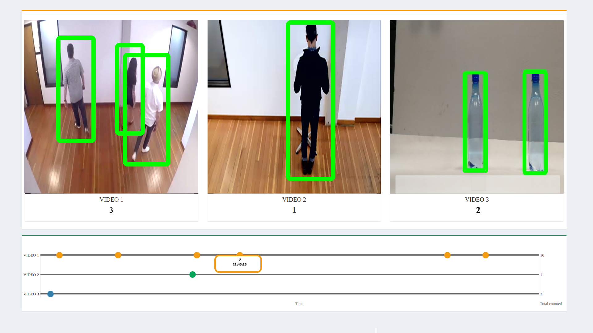

# IoT Reference Implementation: Store Traffic Monitor


An application capable of detecting objects on any number of screens.

## What it Does
This application is one of a series of IoT reference implementations aimed at instructing users on how to develop a working solution for a particular problem. It demonstrates how to create a smart video IoT solution using Intel® hardware and software tools. This reference implementation monitors people activity inside and outside a facility as well as counts product inventory.

## How it Works
The counter uses the Inference Engine included in OpenVINO™. A trained neural network detects objects within a designated area by displaying a green bounding box over them. This reference implementation identifies multiple intruding objects entering the frame and identifies their class, count, and time entered.

## Requirements
### Hardware
* 6th Generation Intel® Core™ processor with Intel® Iris® Pro graphics and Intel® HD Graphics

### Software
* [Ubuntu\* 16.04 LTS](http://releases.ubuntu.com/16.04/)
*Note*: We recommend using a 4.14+ Linux kernel with this software. Run the following command to determine your kernel version:

```
uname -a
```
* OpenCL™ Runtime Package
* OpenVINO™

## Setup

### Install OpenVINO™
Refer to https://software.intel.com/en-us/articles/OpenVINO-Install-Linux for more information about how to install and setup the OpenVINO™.

You will need the OpenCL™ Runtime Package if you plan to run inference on the GPU as shown by the
instructions below. It is not mandatory for CPU inference.

### Ffmpeg
ffmpeg is installed separately from the Ubuntu repositories:
```
sudo apt update
sudo apt install ffmpeg
```

## Build the application

To build, open a terminal in the `application` folder and run the following commands:

```
source env.sh
mkdir -p build && cd build
cmake ..
make
```

The new version of the software will be built as build/object_counter.

## Configure the application

All configurations are written to resources/conf.txt
* 1st line: `path/to/model.xml`  
   This is the path to the model topology on the local system.  
   The model topology file is the .xml file that the model optimizer produces, containing the IR of the model's topology.

* 2nd line: `path/to/model.bin`  
   This is the path to the model weights on the local system.  
   The model weights file is the .bin file that the model optimizer produces, containing the IR of the model's wights.

* 3rd line: `path/to/labels`  
   This is a path to the labels file on the local system.  
   The labels file is a text file containing, all the classes/labels that the model can recognize, in the order that it was trained to recognize them (one class per line). All detection models work with integer labels and not string labels (e.g. for the SSD model, the number 15 represents the class "person").   
   For the ssd300 model, we provide the class file labels.txt in the [resources folder](./application/resources/labels.txt).
   
Each of the following lines contain the `path/to/video` followed by the label to be detected on that video, e.g.:
```
videos/video1.mp4 person
```
The `path/to/video` is the path, on the local system, to a video to use as input. The labels used must coincide with the labels from the labels file.

### What model to use
The application works with any object-detection model, provided it has the same input and output format of the SSD model.  
The model can be any object detection model:
* that is provided by OpenVINO™.  
   These can be found in the `deployment_tools/intel_models` folder.
* downloaded using the **model downloader**.   
   These can be found in the `deployment_tools/model_downloader/object_detection` folder.
* created by the user

For first-use, we recommend using the ssd300 model provided by the **model downloader**.

### What input video to use
The application works with any input video.
Sample videos for object detection are provided [here](https://github.com/intel-iot-devkit/sample-videos/).  


For first-use, we recommend using the [people-detection](https://github.com/intel-iot-devkit/sample-videos/blob/master/people-detection.mp4), [one-by-one-person-detection](https://github.com/intel-iot-devkit/sample-videos/blob/master/one-by-one-person-detection.mp4), [bottle-detection](https://github.com/intel-iot-devkit/sample-videos/blob/master/bottle-detection.mp4) videos.   
E.g.:
```
sample-videos/people-detection.mp4 person
sample-videos/one-by-one-person-detection.mp4 person
sample-videos/bottle-detection.mp4 bottle
```
### Having the input video loop
By default, the application reads the input videos only once, and ends when the videos end.
In order to not have the sample videos end, thereby ending the application, the option to continously loop the videos is provided.   
This is done by running the `make` command with the `UI_LOOP` variable set. E.g.:
```
make CXX_DEFINES=-DLOOP_VIDEO
```

### Using camera stream instead of video file
Replace `path/to/video` with the camera ID, where the ID is taken from yout video device (the number X in /dev/videoX).
On Ubuntu, to list all available video devices use the following command:
```
ls /dev/video*
```

## Run the application

If not in build folder, go there by using:

```
cd build/
```

And then run the program:

```
./store-traffic-monitor
```

## Running on the integrated GPU (optional)
By default, the application runs on the CPU. A user can specify what target device to run on by changing the `conf_targetDevice` variable in the `include/videocap.hpp` file.   
To run on the GPU, use `static const string conf_targetDevice = "GPU"` instead.

## Using the browser UI

The default application uses a simple user interface created with OpenCV.
A web based UI, with more features is also provided [here](./UI).
In order for the application to work with the browser UI, the output format must be slightly changed. This is done, by running the `make` command with the `UI_OUTPUT` variable set.

E.g. with the video loop also active:
````
make CXX_DEFINES="-DLOOP_VIDEO -DUI_OUTPUT"
````
